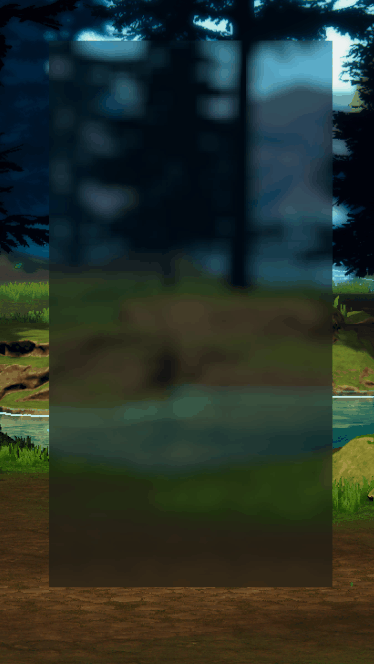

# UI Blur Shader for Unity URP

This repository provides a UI Blur Shader designed for Unity's Universal Render Pipeline (URP) **UNTESTED ON HDRP**. It allows you to apply dynamic blur effects to UI elements, with customizable parameters such as blur strength, kernel size, and alpha blending. Follow the steps below to integrate it into your project.
This shader allows you to apply **different blur effects to individual UI elements** simultaneously in Unity URP. Perfect for creating depth in menus or highlighting specific components.
Is WAY more demanding, if you use to much objects, so, for a global solution, consider [Unified Universal Blur](https://github.com/lukakldiashvili/Unified-Universal-Blur).

---

## Prerequisites
- Unity 6.0 or later.
- Universal Render Pipeline (URP) configured in your project.

---

## Installation & Usage

### 1. Import the Unity Package
1. Download the `UIBlurShader.unitypackage` from the [Releases](https://github.com/yourusername/your-repo/releases) section.
2. In Unity, navigate to **Assets > Import Package > Custom Package**.
3. Select the downloaded `.unitypackage` and import all files.

### 2. Add Blur Feature to the Universal Renderer Data
1. Open your URP settings: **Edit > Project Settings > Graphics > Scriptable Render Pipeline Settings**.
2. Locate your active Renderer Data (e.g., `UniversalRenderer_Forward.asset`).
3. Click **Add Renderer Feature** and select **Blur Feature** from the dropdown.
4. Save the changes.

### 3. Create a Material from the UIBlur Shader
1. Right-click in the Project window and select **Create > Material**.
2. Name the material (e.g., `UI_BlurMaterial`).
3. In the material inspector, click the Shader dropdown and select **UIBlur** from the list.

### 4. Apply the UIBlur Material to a UI Element
1. Select a UI element (e.g., a `Panel`, `Image`, or `RawImage`) in your scene.
2. In the Inspector window, locate the **Material** field (under the component's properties).
3. Assign the `UI_BlurMaterial` you created.

### 5. Adjust Material/Element Parameters
Customize the blur effect using the following parameters in the material or UI element:
- **Size**: Controls the kernel size of the blur (higher values = wider blur spread).
- **Strength**: Adjusts the Gaussian weights for blur intensity (higher values = stronger blur).
- **Element Alpha**: Lerps between the element's current vertex color and the blurred background texture (0 = fully blurred, 1 = element color).

### 6. Example Configuration


```yaml
- Element Color: (0, 0, 0, 0.15)
- Size: 5.0
- Strength: 5.0
